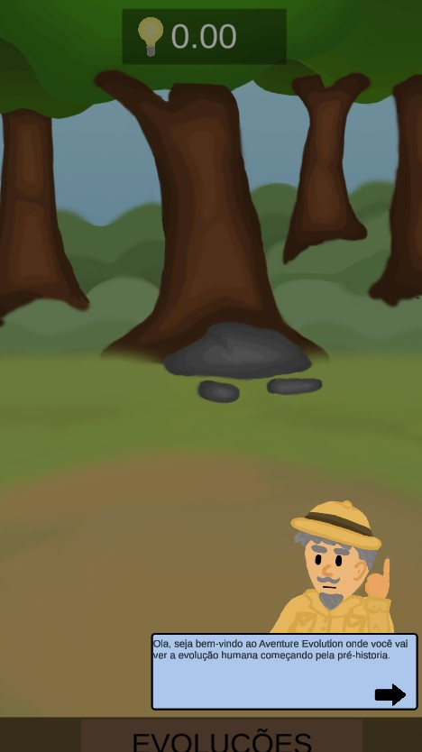
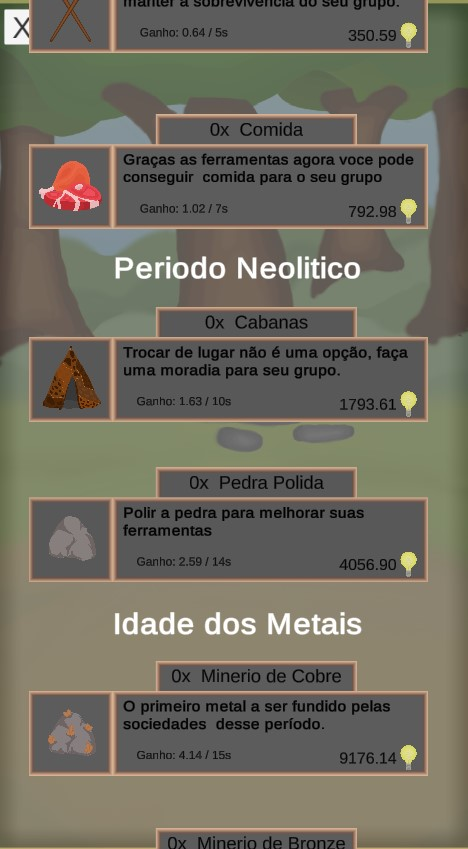
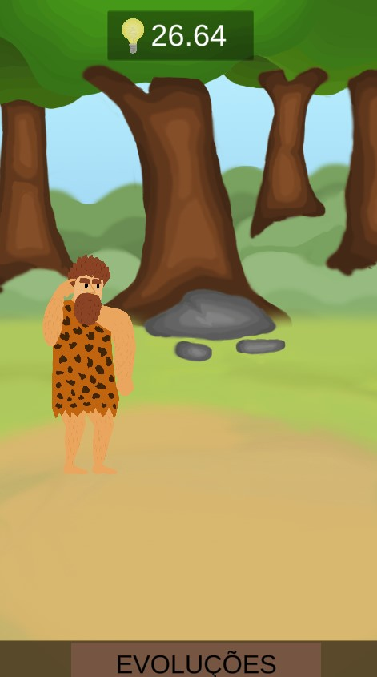

# ADVENTURE EVOLUTION

## **Sobre projeto:**

Desenvolvido no quarto semestre da faculdade,  o projeto precisava ser para mobile e educativo então eu e meu grupo tivemos a ideia de ensinar a historia em um jogo idle onde o jogador vai passar por cada parte da pré-historia do período paleolítico ate a idade dos metais.

## **Linguagem e engine utilizada**

- [C#](https://docs.microsoft.com/pt-br/dotnet/csharp/)
- [Unity](https://unity.com/pt)

## Imagens:

### Link para jogar

https://gabrieltorres.itch.io/adventure-evolution
